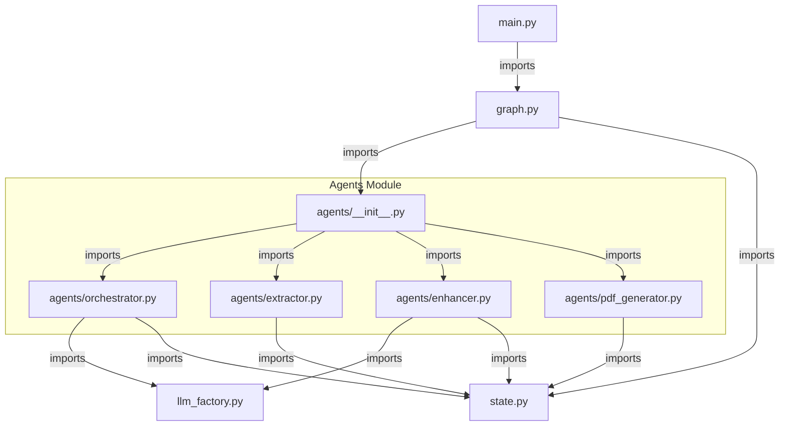

# Resumatic 🎯

A multi-agent resume tailoring system powered by **LangGraph** and **FastAPI**, featuring an intuitive modern web frontend with drag-and-drop resume import.

Upload your existing resume (PDF or DOCX) and a target job description — the AI pipeline extracts your resume content, tailors it to the job, and returns a professionally formatted PDF resume.

---

## Architecture

```
Web Frontend (drag-and-drop UI)
     │
     │  POST /tailor-resume
     │  multipart/form-data
     ▼
┌─────────────────────────────────────────┐
│           FastAPI REST API              │
│                                         │
│  ┌──────────────────────────────────┐   │
│  │    LangGraph StateGraph          │   │
│  │                                  │   │
│  │  Agent 1: Orchestrator (LLM) ◄─┐│   │
│  │      │ extract                  ││   │
│  │      ▼                          ││   │
│  │  Agent 2: Extractor (no LLM)   ─┘│   │
│  │      │ enhance                  ││   │
│  │      ▼                    ◄─────┘│   │
│  │  Agent 3: Enhancer (LLM)  ──────►│   │
│  │      │ generate                  │   │
│  │      ▼                           │   │
│  │  Agent 4: PDF Generator (no LLM) │   │
│  └──────────────────────────────────┘   │
└─────────────────────────────────────────┘
     │
     │  Response: application/pdf
     ▼
tailored_resume.pdf
```

### The Four Agents

| Agent | Role | Uses LLM? |
|---|---|---|
| **Agent 1 — Orchestrator** | Supervisor — validates inputs, routes between workers, handles errors | ✅ Yes |
| **Agent 2 — Extractor** | Parses PDF/DOCX resume into structured data (regex + heuristics) | ❌ No |
| **Agent 3 — Enhancer** | Rewrites resume content to match the job description | ✅ Yes |
| **Agent 4 — PDF Generator** | Renders the enhanced content as a clean PDF | ❌ No |

---

# Resumatic Component Dependencies

This diagram illustrates the dependencies between all `.py` files in the Resumatic project. It focuses on internal module imports.




## Quickstart

### 1. Clone & install dependencies

```bash
git clone <repo-url>
cd resumatic
python3 -m venv .venv
source .venv/bin/activate
pip install -r requirements.txt
```

### 2. Configure environment

```bash
cp .env.example .env
# Edit .env and add your API key:
#   OPENAI_API_KEY=sk-...
#   MODEL_NAME=gpt-4o-mini
# Or for Google Gemini:
#   GOOGLE_API_KEY=AIza...
#   MODEL_NAME=gemini-2.0-flash
```

### 3. Start Frontend & Backend

#### Method A: Using the Startup Script (`start.sh`)

The included `start.sh` script automatically activates the virtual environment, checks configuration, and launches the services.

```bash
chmod +x start.sh
./start.sh
```

By default, this launches:
- **Frontend Web UI**: [http://localhost:3000](http://localhost:3000) (and [http://localhost:8000](http://localhost:8000))
- **Backend API**: [http://localhost:8000](http://localhost:8000)
- **Interactive Swagger Docs**: [http://localhost:8000/docs](http://localhost:8000/docs)
- **Health Check**: [http://localhost:8000/health](http://localhost:8000/health)

Press `Ctrl+C` at any time to cleanly stop both services.

**Script flags:**
```bash
./start.sh              # Default: runs backend (:8000) & frontend (:3000)
./start.sh --unified    # Unified mode: FastAPI serves both API & frontend (:8000)
./start.sh --backend    # Runs backend API only (:8000)
./start.sh --frontend   # Runs frontend web server only (:3000)
./start.sh --help       # Display help menu
```

---

#### Method B: Manual Commands

##### 1. Unified Mode (FastAPI serves Backend + Frontend)
Since FastAPI mounts the `frontend/` directory, you can run both frontend and backend on a single port:

```bash
uvicorn main:app --reload --port 8000
```
Open your browser at **[http://localhost:8000](http://localhost:8000)**.

##### 2. Separate Frontend and Backend
If you prefer running frontend and backend in isolated terminal processes:

- **Terminal 1 (Backend API):**
  ```bash
  uvicorn main:app --reload --port 8000
  ```

- **Terminal 2 (Frontend Static Server):**
  ```bash
  python3 -m http.server 3000 --directory frontend
  ```
  Then open **[http://localhost:3000](http://localhost:3000)** in your browser. (The frontend automatically routes API requests to `http://localhost:8000`).

---

## Web Frontend Features

The frontend is completely isolated in the `frontend/` directory with zero build dependencies (vanilla HTML5, CSS3, and modern ES6 JavaScript):

- **Drag-and-Drop Resume Upload**: Drag `.pdf` or `.docx` files directly into the drop zone with instant visual feedback and active state styling.
- **Click-to-Browse**: Standard accessible file picker fallback.
- **Client-Side Validation**: Immediate validation for file format and file size limits (max 10 MB).
- **File Preview & Remove**: Displays filename, formatted size, and quick removal.
- **Job Description Input**: Expandable textarea with live character counter.
- **Multi-Stage Progress Indicator**: Visual step-by-step pipeline status (*Extracting* → *Enhancing* → *Generating PDF*).
- **Automatic PDF Download**: Automatically triggers download of the tailored PDF upon completion, with a "Download Again" option.
- **Error Feedback**: User-friendly alerts and "Try Again" recovery.
- **Responsive Layout**: Designed for mobile, tablet, and desktop screens.

---

## API Reference

### `POST /tailor-resume`

| Field | Type | Required | Description |
|---|---|---|---|
| `resume` | File | ✅ | Resume file (PDF or DOCX) |
| `job_description` | string (form) | ✅ | Target job description text |

**Response:** `application/pdf` — the tailored resume as a downloadable file.

#### cURL example

```bash
curl -X POST http://localhost:8000/tailor-resume \
  -F "resume=@./sample/sample_resume.pdf" \
  -F "job_description=$(cat ./sample/sample_jd.txt)" \
  --output tailored_resume.pdf
```

#### JavaScript `fetch` example

```javascript
const formData = new FormData();
formData.append('resume', fileInput.files[0]);
formData.append('job_description', document.getElementById('jd').value);

const response = await fetch('http://localhost:8000/tailor-resume', {
  method: 'POST',
  body: formData,
});

const blob = await response.blob();
const url = URL.createObjectURL(blob);

// Trigger download
const a = document.createElement('a');
a.href = url;
a.download = 'tailored_resume.pdf';
a.click();
```

### `GET /health`

```bash
curl http://localhost:8000/health
# {"status":"ok","service":"Resumatic API"}
```

---

## Project Structure

```
resumatic/
├── start.sh              # Startup script for frontend and backend
├── main.py               # FastAPI app — endpoints, CORS, static frontend mount
├── graph.py              # LangGraph StateGraph wiring
├── state.py              # Shared state schema (ResumaticState TypedDict)
├── frontend/             # Dedicated isolated frontend directory
│   ├── index.html        # Single-page web interface (semantic HTML)
│   ├── css/
│   │   └── styles.css    # Responsive styling, animations & theme
│   └── js/
│       └── app.js        # Drag-and-drop, API integration & state management
├── agents/
│   ├── __init__.py
│   ├── orchestrator.py   # Agent 1: Supervisor (LLM)
│   ├── extractor.py      # Agent 2: Resume parser (no LLM)
│   ├── enhancer.py       # Agent 3: Content tailor (LLM)
│   └── pdf_generator.py  # Agent 4: PDF builder (no LLM)
├── sample/
│   └── sample_jd.txt     # Sample job description for testing
├── output/               # Generated PDFs (gitignored)
├── uploads/              # Temp upload files (gitignored)
├── requirements.txt
├── .env.example
└── README.md
```

---

## LLM Provider

The system supports **OpenAI** (default) or **Google Gemini**.

Set in `.env`:

```bash
# OpenAI (default)
OPENAI_API_KEY=sk-...
MODEL_NAME=gpt-4o-mini

# OR Google Gemini
GOOGLE_API_KEY=AIza...
MODEL_NAME=gemini-2.0-flash
```

---

## Key LangChain / LangGraph Concepts Demonstrated

| Concept | Where |
|---|---|
| Supervisor Pattern | `orchestrator.py` — delegates to workers |
| Shared State | `state.py` — single `ResumaticState` TypedDict |
| Heterogeneous Agents | Agents 1 & 3 use LLM; Agents 2 & 4 do not |
| Conditional Routing | `graph.py` — `add_conditional_edges()` |
| Structured Output | `enhancer.py` — `llm.with_structured_output()` |
| API-First Design | `main.py` — FastAPI decouples backend from frontend |
